## <ins>Phindr3D User Manual</ins>

### <ins>Main Program</ins>

 

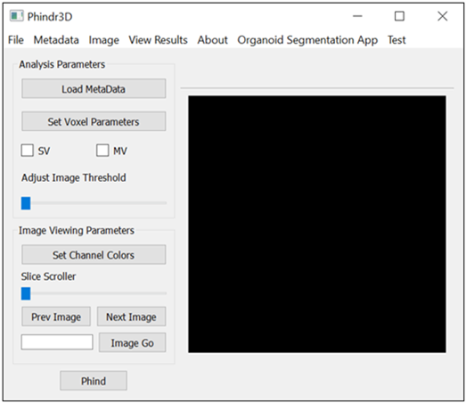</img>

 

### <ins>Creating Metadata</ins>

Phindr3D requires a metadata file to properly load 3D multichannel images.  

- Clicking on Metadata > Create Metafile opens a new window for creating metadata.

 

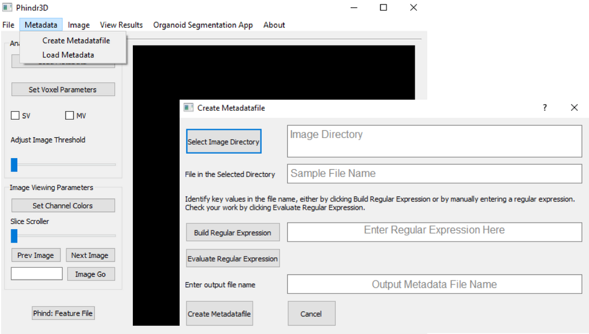</img>

 

 

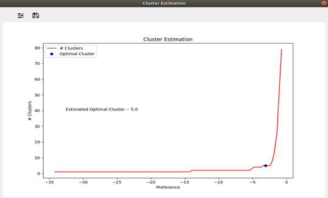</img>

 

 

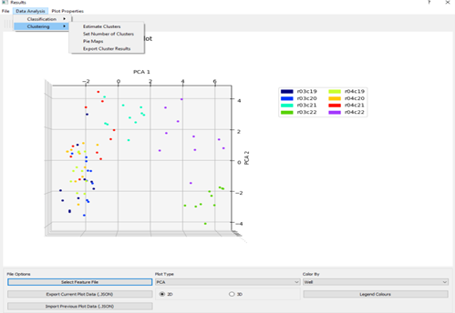</img>

 

 

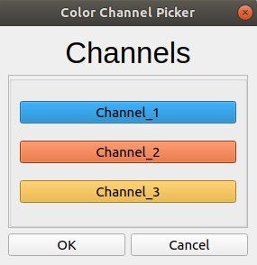</img>

 

 

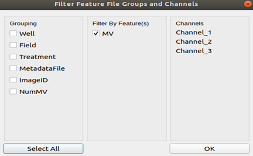</img>

 

 

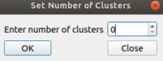</img>
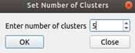</img>

 

 

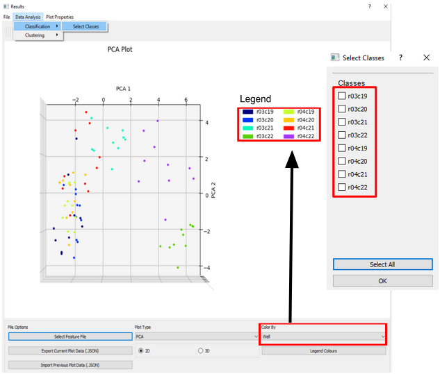</img>

 

 

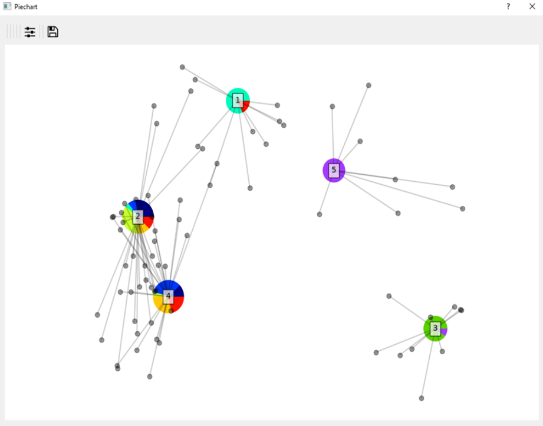</img>

 

 

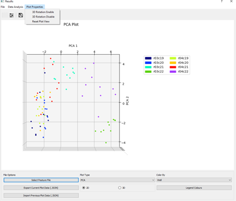</img>

 

 

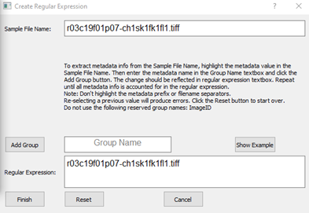</img>

 

 

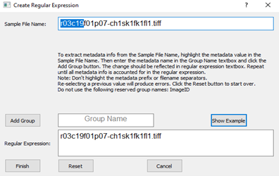</img>

 

 

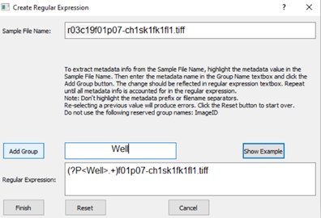</img>

 

 

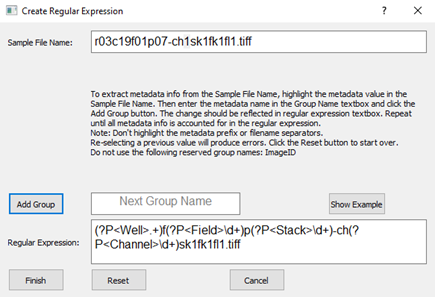</img>

 

 

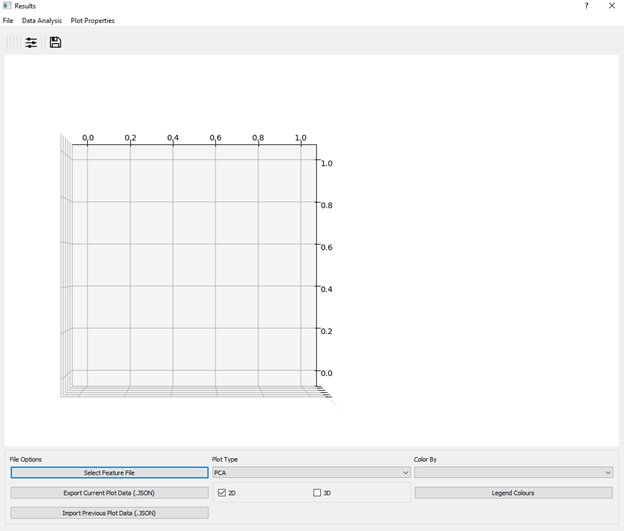</img>

 

 

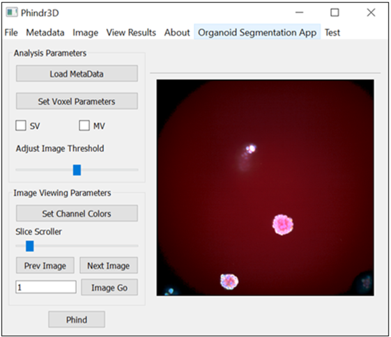</img>

 

 

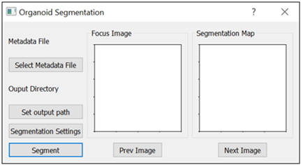</img>

 

 

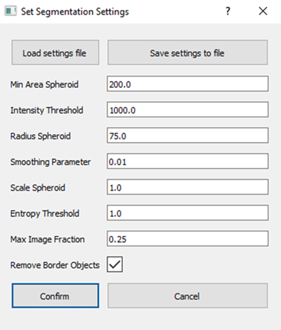</img>

 

 

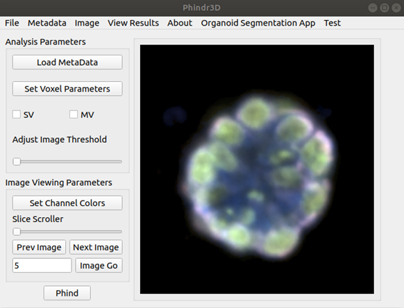</img>

 

 

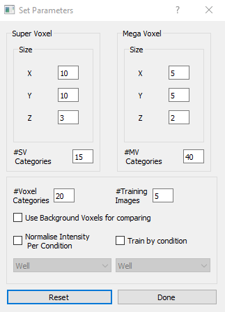</img>

 

 

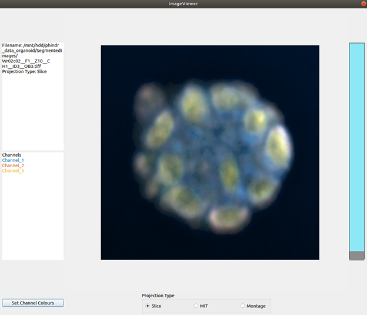</img>

 

